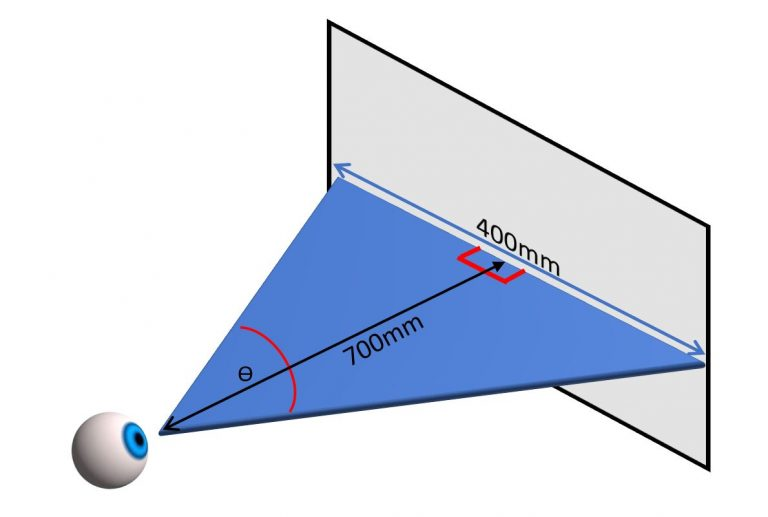
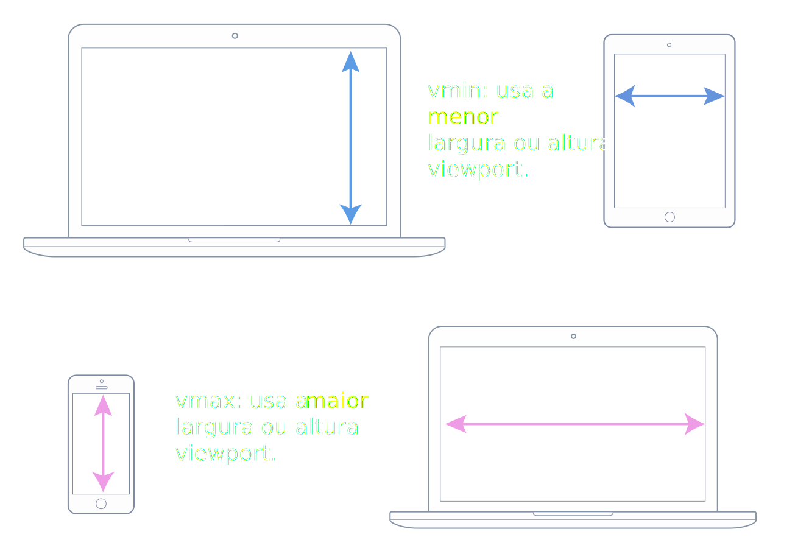
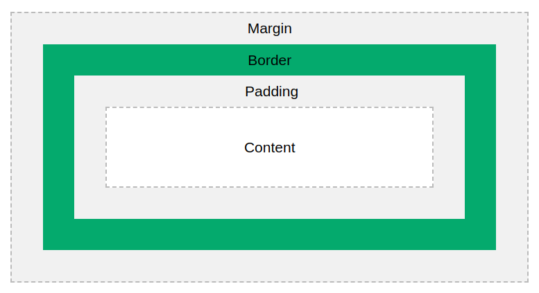

## Elementos Semânticos

## Estrutura de pastas

    └── root/
        ├── images
        ├── pages
                sobre.html
        ├── samples/
        │   └── test
        ├── src/
        │   └── css
        ├── index.html
        └── readme-md

### Resolução de tela: 1920 X 1080

-   Pasta - R$ 56
-   Filé Mignon R$ 42
-   Spaghetti R$ 32
-   Sopa com vegetais R$ 16
-   Noodles R$ 21
-   Frango R$ 28
-   Pizza vegetariana R$ 45
-   Salmão R$ 84
-   Penne R$ 65

## Microdados

-   Parte do padrão HTML. Mecânismos de pesquisa e rastreadores consomem os dados com mais eficiência.-
-   Servem para aninhar metadados em conteúdo existente em páginas WEB. (Microdata,RDFa,JSON-LD)

### Microdata

  Angry Birds -

REQUIRES ANDROID 

  <link itemprop="applicationCategory" href="https://schema.org/GameApplication"/>

  

    Pontuação:
    4.6 (
    8864 avaliações )
  

  

    Preço: $R$ 10.00
    <meta itemprop="priceCurrency" content="USD" />
  

## RDFa

<!DOCTYPE html>
<html lang="pt">
  <head>
    <title>Exemplo de documento</title>
  </head>
  <body vocab="http://schema.org/" >
    

      Bem-vindo ao <a property="url" href="http://texpersts.com.br/blog">blog da T.EX</a>.
    

  </body>
</html>

## JSON-LD (Link Data)

<html>
  <head>
    <title>Bolo de Café</title>
    
</head>
    <body>
      <h2>Bolo de Café</h2>
      

        <i>por Fernando M.Sousa, 10-06-2022</i>
      

      

        Este bolo é perfeito para sua festa.
      

      

        Preparação: 20 minutos
      

    </body>
</html>

[cooking](https://giphy.com/gifs/masterchef-chefs-home-cooks-masterchef-season-7-3oEjHC7al4GfnudR7y)

# Cores

W3Schools (color HTML)

<h1 style="color:green">Names</h1>

<h1 style="color:#ff0000">Hexadecimal</h1>
<h1 style="color:#0000ff">Hexadecimal</h1>
<h1 style="color:#0f0">Hexadecimal</h1>
<h1 style="color:#808080">Hexadecimal</h1>
<h1 style="color:rgb(180,200,84)">RGB</h1>
<h1 style="color:hsl(110,80%,40%)">HSL</h1>

 
R     G     B 
0     0     0 = preto 
255   255   255 = branco 
255   0     0 = vermelho 
+++++++++++++++ 
FF    0     0 = vermelho 

0123456789ABCDEF

## LENGTH CSS

---

### px

> Medida angular
> 

### cm, in, mm

Mapeados para pixels

> 1cm == 37.8px  
> 1mm == 0.1cm == 3.78px  

## 1in == 96px

### em

> 1em == 16px == 12pt  
> font-size:14px  
> div > font-size:1.2em
> div > div > div (font-size)  
> 1ª = 16.8px > 2ª = 12.16px > 3ª = 24.192px

---

### rem

> Base no root (html)

---

### pt (print)

> 1pt == 1/72 polegadas

---

### pc (print)

> 1pc == 12pt

---

### %

> img width=50% relativo ao elemento que ela está contida 
> height (atenção com %)

---

### vh, vw

> 1vh == 1% da altura da janela de visualização 
> 1vw == 1$ da largura da janela de visualização 

---

### vmax, vmin

---

## TEXT

> color (names,hexa,rgb,hsl,gradient)[]

---

> ALIGN

-   text-align [x]
-   text-aling-last [x]
-   direction [x]
-   vertical-align [x]

---

> DECORATION

-   line [x]
-   color [x]
-   style [x]
-   thickness [x]
-   decoration [x]

> SPACING

-   text-indent [x]
-   letter-spacing [x]
-   line-height [x]
-   word-spacing [x]
-   white-space [x]

> TRANSFORM

-   uppercase [x]
-   lowercase [x]
-   capitalize [x]

---

# SELETORES

## Simples

-   Nomes, ids e classes

## Combinações

-   Relação entre elementos
-   Adjacente (+), Descendente ( )  
-   ## Seletor filho (>), Seletor vizinho (~)

## Pseudo Elements

-   Partes de um elemento

::first-letter  
::marker  

> ---

## Pseudo Class

-   Estado de um elemento

:hover  
:checked 
:active

> ---

## Atributos

-   Atributos e valores de um elemento
    > input[type=text]

> ---

## Prefixo dos Browsers

-   webkit [-webkit] chrome, safari, opera+
-   moz [-moz] firefox
-   o [-o] opera-
-   ms [-ms] internet explorer, edge

## Fontes

> Com Serifa (serif)

---

Lorem Ipsum

-   Georgia
-   Garamond

---

> Sem Serifa (sans-serif)

Lorem Ipsum

-   Verdana
-   Helvética

> Monoespaçadas (letras com a mesma largura fixa)

-   Courier New
-   Lucida Console

> Cursivas (imitam a escrita humana)

-   Lucida Handwriting
-   Brush Script MT
-   > Fantasia
-   Copperplate
-   Papyrus

---

# BOX MODEL

> width | height

> max-width | min-width

> margin: 0 0 0 0 (top right bottom left)

> padding: 0 0 0 0 (top right bottom left)

> border-width: 0 0 0 0 (top right bottom left)

> border-radius: 0 0 0 0 (top right bottom left)

## Variações

> margin:0 (todos os lados)

> margin: 0 0 (top/bottom right/left)

BASE

Lorem Ipsum

NEXT

# POSITION

    

        
Lorem Ipsum

        

---

>## position: sticky
>## display: none | inline-block | block
>## float
>## opacity

---

# GRID

    

        
Lorem Ipsum

        

#

<table>
<tr>
<th>Pratos</th>
<th>Sobremesas</th>
<th>Acompanhamentos</th>
<th>Bebidas</th>
</tr>
<tr>
<td>Picanha</td>
<td>Sorvete</td>
<td>Salada</td>
<td>Água com gás</td>
</tr>
<tr>
<td>Pasta Italiana</td>
<td>Bolo de Limão</td>
<td>Fritas</td>
<td>Água sem gás</td>
</tr>
<tr>
<td>Brasileira</td>
<td>Bolo de Laranja</td>
<td>Bacon</td>
<td>Chá Inglês</td>
</tr>
<tr>
<td>Feijoada</td>
<td>Pêssego em Calda</td>
<td>Macaxeira</td>
<td>Café Espresso</td>
</tr>
<tr>
<td>Baião de Dois</td>
<td>Bomba de Chocolate</td>
<td>Pirão</td>
<td>Suco de Graviola</td>
</tr>
</table>

# BootStrap

>Extra Small
- (< 576px = 100% )
  
>Small - sm
- ( > 576px = 540px )

>Medium - md
- (> 768px = 720px )

>Large - lg
- (> 992px = 960px)

>Extra Large
- ( > 1200px = 1440px )

>XXLarge
- ( >1400px = 1320px )

# Responsive Design

>Mobile (portrait)
- 320
- 375
- 414

>Mobile (landscape)
- 568
- 667
- 736
- 812

>Tablet (potrait)
- 768
- 834

>Tablet (landscape)
- 1024
- 1112

>Laptop 
- 1366
- 1440

>Desktop
- 1680
- 1920
- 2048
---
## Fluid Grids
---
Linhas e colunas que se ajustam mediante os breakpoints

---

## Breakpoints
Pontos de tamanho tela especificados no css associados a janela de visualização (@media)

---

## Flexible Images
Verificar o redimensionamento das imagens que é feito em porcentagem.

---
## Media Querie

Especificacões CSS que contém as informações sobre a janela de visualização
---
## Viewport

        <meta name="viewport" content="width=device-width, initial-scale=1.0" />

---
## Overflow

Elementos de tela que  estão fora do layout, ou parcialmente fora do layuot

---
## Fixed Size
Utilizam pixels como largura ou altura.

---

## Relative Size
Utilizam medidas como rem ou %

---

## Mobile First
Técnica de layout ue primeiro analisa telas menores, para depois pensar em telas mais largas

---
## Hamburguer Menu

---
---

# Box Sizing

>Width = Padding+Width+Border

>Height = Padding+Height+Border

Lorem Ipsum

Lorem Ipsum

Lorem Ipsum

 

---

# DropDown Menu

  <button class="drop-bt">Menu DropDown</button>
  

    <a href="#">Link 1</a>
    <a href="#">Link 2</a>
    <a href="#">Link 3</a>
  

--- 
---

# Paginação

  <a href="#">&laquo;</a>
  <a href="#">1</a>
  <a href="#">2</a>
  <a class="active" href="#">3</a>
  <a href="#">4</a>
  <a href="#">5</a>
  <a href="#">6</a>
  <a href="#">&raquo;</a>

---

# FLOAT

 

Lorem ipsum dolor sit amet consectetur
adipisicing elit. Id voluptates dolores
autem dolorem quos quis nulla illum pariatur
magnam.

 

Lorem ipsum dolor sit amet consectetur
adipisicing elit. Id voluptates dolores
autem dolorem quos quis nulla illum pariatur
magnam.

<button
style="float:left;
padding:2%"
>Lorem Isum</button>
<button 
style="float:right;
padding:2%"
>Lorem Isum</button>

<button
style="float:left;
padding:2%"
>Lorem Isum</button>
<button 
style="float:left;
padding:2%"
>Lorem Isum</button>

<button
style="float:left;
padding:2%"
>Lorem Isum</button>
<button 
style="float:left;
padding:2%"
>Lorem Ipsum</button>

